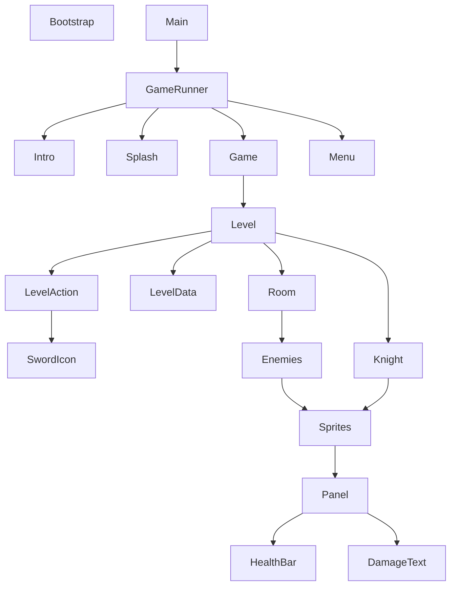

## Arkkitehtuurikuvaus
# Rakenne
Pelin perusrakenteen muodostavat pelin pyörittämisestä vastaava GameRunner-luokka, pelin tilasta vastaavat states (Game, Menu, Intro, Splash) luokat ja tason hallinnasta vastaava Level-luokka, sekä siihen liittyvät tason hallintaan liittyvät luokat.

## Käyttöliittymä

Pelin käyttöliittymä rakentuu pelin state-engine rakenteen pohjalle. Erilaisia näkymiä on 5.

- Intro
- Siirtymä (Splash)
- Pelitila (Game)
- Menu
- End Screen

Jokainen pelitiloista on toteutettu omana luokkanaan ja ne perivät samasta GameState pääluokasta. Lisäksi Game-tilassa hahmon ja vastustajien näkyvistä parametreista (elämäpisteet) vastaa Panel-luokka, joka perii tietoa Sprites-ryhmästä, sekä hahmojen yksilöllisistä HealthBareista. Hahmojen iskut luovat lisäksi iskun voimakkuudesta kertovan tekstin DamageText-luokasta.

SwordIcon-luokka on yhteydessä hiiren kursoriin ja ilmestyy näytölle kun pelaaja voi lyödä vastustajan hahmoa.

## Sovelluslogiikka

Pelin sovelluslogiikka rakentuu pitkälti pelin pyörittämisestä vastaavan GameRunner-luokan, pelin pelitilasta vastaavan Game-luokan ja tason hallinnasta vastaavan Level-luokan pohjalle. Level-luokka alustaa tason luokan Room pohjalta ja pitää kirjaa tason läpäisyyn tai häviämiseen liittyvistä tiedoista.

GameRunner vastaa Game-tilan päivittämisestä update-metodilla ja Game-tila vastaavasti tason päivittämisestä omalla update metodillaan. Level-luokan toiminnan kannalta LevelData-luokka ylläpitää tärkeää data tason tilasta ja hahmojen toimintavuorosta.

## Level-luokan toiminta

Level-luokan kutsumisen yhteydessä kontruktorista kutsuttava luokkametodi initialize_level() alustaa tason injektoidun Room-luokan pohjalta. Tason alustamiseen kuuluu hahmojen lisääminen ja tilan resetoiminen. Tason tilaa säätelee metodi update(), jota kutsutaan pelin Game-tilasta. Level-luokan update metodi vastaa hahmojen tilan ja toiminnan päivittämisestä, sekä tason voitto- tai häviö ehtojen tarkastamisesta.

Hahmojen toiminnan kannalta LevelAction- ja LevelData-luokat ovat keskiössä. LevelData pitää kirjaa hahmojen toimintavuorosta ja LevelAction kutsuu hahmoja toimimaan vuoron koittaessa. LevelAction myös lukee pelaajan syötettä, eli valintaa siitä mitä vihollista pelaaja haluaa iskeä.

## Bootstrap-container

Riippuvuuksien injektointiin on käytetty ulkoista kirjastoa "kink", jonka pohjalta on luotu bootstrap_di säiliö riippuvuuksien varastoimiseksi. Riippuvuuksien injektointia on hyödynnetty ohjelman rakenteessa testaamisen helpottamiseksi.

## Ohjelman rakenteeseen jääneet heikkoudet

Ohjelmassa ei ole pysyväistallennusta ja huoneet on toistaiseksi kovakoodattu peliin.
